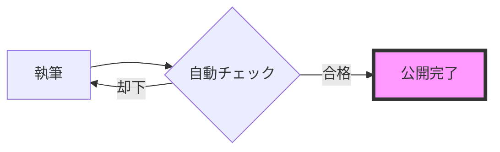

# Material for MkDocs 機能デモンストレーション

本ページでは、Doc as a Code環境で利用可能な主要コンポーネントを紹介します。

---

## 1. アドモニション（視覚的な強調）
情報を整理し、読み手の注意を引くためのスタイル付きブロックです。

```
!!! info "プロジェクトの現状"
    現在のフェーズは「プロトタイプ構築」です。

!!! danger "機密事項"
    本ドキュメントの外部共有を禁じます。

??? question "詳細な計算根拠（クリックで展開）"
    ROIの算出根拠は、年間削減工数 500h × 単価 5,000円 に基づいています。

???+ tip "最初から開いているヒント"
    `???+` を使うと、重要度が高い補足情報を最初から見せた状態で配置できます。
```

---

## 2. コンテンツ・タブ
画面を占有せず、複数のカテゴリ情報を切り替えて表示します。

```
=== " 投資対効果"
    *   **コスト削減**: 年間 250万円 相当の工数削減
    *   **資産化**: 属人化したノウハウの共有知化

=== " スピード"
    *   **更新速度**: 修正から公開まで最短 2分
    *   **検索性**: 全文検索による即時アクセス
```

---

## 3. 自動生成される図解 (Mermaid)
テキストベースで記述されたフローチャートです。画像管理の手間を排除します。



---

## 4. 進化したコード表現
技術情報の共有を劇的に効率化します。

```python linenums="1"
def calculate_roi(saving, cost):
    # 投資対効果を計算する関数
    result = (saving - cost) / cost
    return result # (1)
```

1.  **注釈機能**: このように、コードの特定の行にマウスを合わせるとポップアップで解説が表示されます。

---

## 5. インタラクティブなUI要素

### アクションボタン

```
 [IT戦略を確認する](strategy/roadmap.md){ .md-button .md-button--primary }
 [セキュリティ規定](tech/security.md){ .md-button }
```

### 用語ツールチップ
```
*[ROI]: Return On Investment（投資利益率）
*[KPI]: Key Performance Indicator（重要業績評価指標）
```

このプロジェクトの **ROI** を最大化し、**KPI** を達成するための基盤を構築します。
（※単語にカーソルを合わせると説明が表示されます）

---

## 6. 比較表（テーブル）

```
| 比較項目 | 従来のWord/Excel管理 | Doc as a Code (本基盤) |
| :--- | :--- | :--- |
| **情報の鮮度** |  常に古い版が混在 |  常に最新版がWebに公開 |
| **アクセス性** |  共有フォルダを探す |  ブラウザから1クリック |
| **変更履歴** |  ファイル名で管理 |  Gitによる完全な履歴追跡 |
```

## 7. タスクリスト

```
- [x] 全社員への公開・周知
- [ ] 全社員への公開・周知
```

---
[ホームに戻る](index.md)