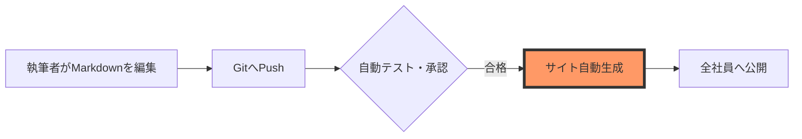

# 更新プロセスと自動化

経営層が懸念する「運用の手間」を、自動化（CI/CD）で解決していることを示します。

```mermaid
graph LR
    A[執筆者がMarkdownを編集] --> B[GitへPush]
    B --> C{自動テスト・承認}
    C -->|合格| D[サイト自動生成]
    D --> E[全社員へ公開]
    
    style D fill:#f96,stroke:#333,stroke-width:4px
```