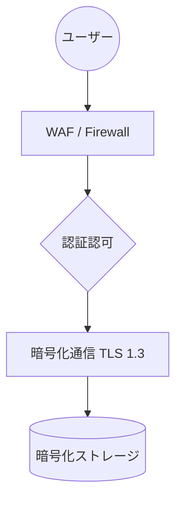

# セキュリティ規定・技術ガバナンス

経営基盤としての信頼性を担保するため、以下のセキュリティレイヤーを実装します。

## 3層のセキュリティ構造

### 1. アクセス制御 (IAM)
*   **認証基盤連携**: Azure AD / Okta等との連携により、シングルサインオン (SSO) を実現。
*   **権限の細分化**: 
    *   `閲覧者`: 全社員
    *   `編集者`: 各部署のドキュメント担当者
    *   `承認者`: 部門責任者 (マージ権限保持者)

### 2. データの機密性と整合性
*   **変更履歴の完全保持**: Gitにより「誰がいつどの文字を変更したか」を永久に記録。改ざんは不可能です。
*   **脆弱性スキャン**: ドキュメント内に機密情報（パスワードやAPIキーなど）が混入していないか、コミット時に自動検知します。

### 3. 物理的・論理的保護

??? note "H および HAMA について"

    ウェブサイトおよび SNS に記載している内容の正誤については一切の責任を負いません。
    情報提供のみを目的としており、情報の取り扱いについては各自の責任にて取り扱いください。
    また、筆者のいかなる所属組織とも一切の関係はなく、所属組織に関連する問い合わせも受け付けません。

